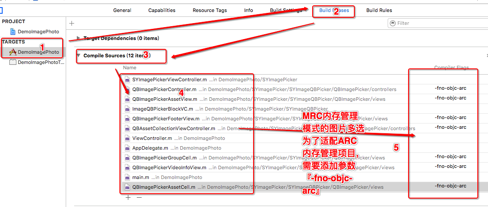

# SYImagePicker

#### iPhone设备拍照和相册图片的使用方法封装，及多图选择库二次封装
通常直接调用手机相册，或拍照时，设置使用代理较麻烦，所以封装成block模式进行使用，代码紧凑，且易于查看。

#### 使用示例
 * SYImagePickerViewController（拍照，或单图选择）
 
````
//步骤1 导入头文件
#import "SYImagePicker.h"

// 步骤2 定义属性
@property (nonatomic, strong) SYImagePickerViewController *imagePicker;

// 步骤3 实例化
self.imagePicker = [[SYImagePickerViewController alloc] init];

// 步骤4 设置数据源
self.imagePicker.pickerSourceType = UIImagePickerControllerSourceTypePhotoLibrary;

// 步骤5 异常判断
if ([self.imagePicker isValidWithPickerSourceType])
{
    [self presentViewController:self.imagePicker animated:YES completion:NULL];

    ViewController __weak *weakSelf = self;
    [self.imagePicker getPickerImage:^(UIImage *image) {
        weakSelf.mainImageView.image = image;
    } error:^{

    } PhotosAlbum:NO saveStart:^{

    } saveFinish:^(SavePhotoStatus status) {

    }];
}
````

 * SYImagePickerQBViewController（多图选择）
 
````
//步骤1 导入头文件
#import "SYImagePicker.h"

// 步骤2 定义属性
@property (nonatomic, strong) SYImagePickerQBViewController *imageQBPicker;

// 步骤3 实例化
self.imageQBPicker = [[SYImagePickerQBViewController alloc] init];

// 步骤4 属性设置
// 是否允许多选时限制最小个数
self.imageQBPicker.limitsMaximumNumberOfSelection = YES;
// 相册类型
self.imageQBPicker.filterType = QBImagePickerFilterTypeAllPhotos;
// 是否允许多选时限制最大个数
self.imageQBPicker.allowsMultipleSelection = YES;
// 多选时最大个数
self.imageQBPicker.maximumNumberOfSelection = 10;

// 步骤5 选择结果回调
[self.imageQBPicker getPickerImage:^(NSArray *images) {

    NSLog(@"images %@", images);

    // 如果有引用其他属性，注意弱引用（避免循环引用，导致内存未释放）
}

} error:^{

}];
// 步骤6 视图跳转
UINavigationController *navMoreQB = [[UINavigationController alloc] initWithRootViewController:self.imageQBPicker];
[self presentViewController:navMoreQB animated:YES completion:NULL];
````

#### 效果图


#### 注意事项




 
